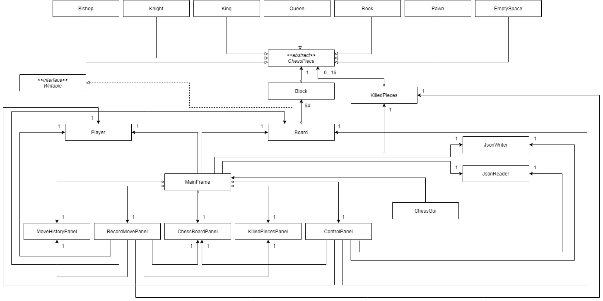

# ♟️ Chess Game

A classic two-player chess game implementation in Java with a graphical user interface.



## 🎮 Features

- Full implementation of chess rules and valid moves
- Graphical user interface for game interaction
- Save and load game functionality
- Move history tracking
- Real-time display of captured pieces
- Turn-based gameplay

## 🚀 Getting Started

### Prerequisites

- Java JDK 11 or higher
- Any Java IDE (IntelliJ IDEA recommended)

### Installation

1. Clone the repository
```bash
git clone https://github.com/yourusername/Chess.git
```

2. Open the project in your IDE

3. Build and run the project
   - For IntelliJ IDEA: Run the `Main` class in the `src` directory
   - For command line:
     ```bash
     javac src/main/java/Main.java
     java src/main/java/Main
     ```

## 📖 How to Play

1. Launch the game
2. Choose to start a new game or load a saved game
3. Players take turns making moves:
   - Click on a piece to select it
   - Valid moves will be highlighted
   - Click on a valid square to move the piece
4. Use the save feature to store your game progress
5. The game ends when a king is checkmated

## 🏗️ Project Structure

```
Chess/
├── src/           # Source files
├── lib/           # Dependencies
├── data/          # Save game files
├── docs/          # Documentation
└── test/          # Test files
```

## 🎯 User Stories

- As a user, I want to:
  - Set up a chess board with pieces
  - Take turns making moves with my opponent
  - Make only valid moves according to chess rules
  - Track captured pieces
  - Save and load game progress
  - Achieve checkmate by capturing the opponent's king

## 🔧 Technical Details

### Architecture

The project follows object-oriented principles with a clear separation of concerns:

- **Model**: Chess game logic and state
- **View**: Graphical user interface
- **Controller**: Game flow and user input handling

### Class Hierarchy

- `ChessPiece` (Abstract Class)
  - `Bishop`
  - `Knight`
  - `Rook`
  - `King`
  - `Queen`
  - `Pawn`
  - `EmptySpace`

Each piece implements the abstract method `isValidMove(Board board, Block startP, Block endP)`.

## 🔄 Future Improvements

- [ ] Add AI opponent
- [ ] Implement online multiplayer
- [ ] Add move timer
- [ ] Include chess puzzles
- [ ] Add move suggestions for beginners

## 📝 License

This project is licensed under the MIT License - see the [LICENSE](LICENSE) file for details.